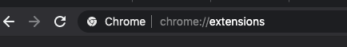
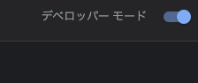
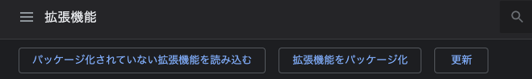
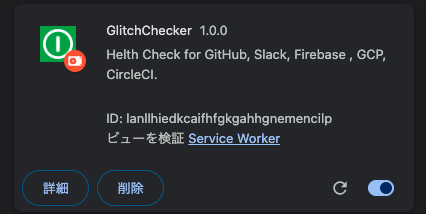
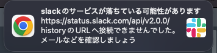
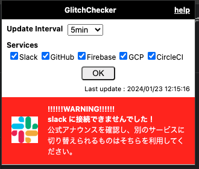
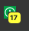
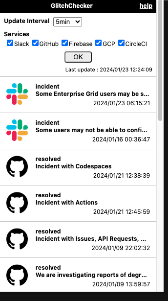

# GlitchChecker (chrome extension版)

## これは何？  

以下のサービスの健康状態(サービスが生きているかどうか？)などを定期的に見てくれる拡張です。  

## インストール方法

1. [ここ](https://github.com/bu-kurokky/apps/raw/main/glitchchecker/glitchchecker_v1.zip)からDownloadボタンを押してzipファイルをDLします。
1. DLしたファイルを解凍します。
1. 下記のようにChromeのURLに「chrome://extensions」と入力します。  
  
1. 拡張機能の画面になったら右上の「デベロッパーモードをON」にします。(ONの人はそのままで大丈夫です)  
  
1. 同じく左上にある「パッケージ化されていない拡張機能を読み込む」をクリックします。  
  
1. 解凍した「glitchchecker_v1フォルダ」を指定します。
1. 拡張一覧に以下のように表示がでればOKです。  
  

## 対応しているサービス

|service|URL|通知フィルタ|
|-|-|-|
|slack|https://status.slack.com/api/v2.0.0/history |incidentのみ|
|GitHub|https://www.githubstatus.com/api/v2/incidents.json |resolvedのみ|
|Firebase|https://status.firebase.google.com/incidents.json |SERVICE_INFORMATION以外|
|GCP|https://status.cloud.google.com/incidents.json |SERVICE_DISRUPTION以外(AVAILABLEなものも除外)|
|CircleCI|https://status.circleci.com/api/v2/incidents.json |resolvedのみ|

## どういう仕組み？

素直に上のURLにアクセスしに言って、404や500エラーを返した場合には以下のようなChromeの通知が出ます。(なのでchromeの通知をOFFにしないでくださいね)  

上記のように明らかな異常でない場合は黄色の通知で指定した時間以内のリストが表示されます。(画像はサンプルです)

## よくある質問

- Q: Microsoftのサービスに対応してほしいんだけど、何故ないの？
- A: だって、ログインが必要なんだもん…
- Q: AWSがないのはなぜ？
- A: だってAWSもログインするか、めちゃくちゃあるjson取得サイトを巡回しなきゃいけないのよ…（拡張が重くなる）
- Q: そもそもjson先のURLに繋がらない = サービスが落ちてるとかユーザーが使えないというのは短絡的では？
- A: そうですね、まぁあくまでも可能性という話であって…
- Q: ヒストリーが見えないのとか、サービスが回復したか？が分からないんだけど
- A: chromeの拡張で簡単にやるのが面倒だったのです…
- Q: 拡張のところでなんか意味不明のエラーが出るよ？
- A: version3になって色々仕様が変わってしまい、かなり無理やり実装しているのでごめんなさい。エラーがあっても動きます。
- Q: AWS! AWS! AWS! AWS!
- A: いつか取れるといいね！
- Q: teams! teams! teams! teams! teams!
- A: お前はマジでもうちょい情報をX(Twitter以外でも)出せ
- Q: リストを見ようとした瞬間にちょうど更新が入って見れなくなったけど？
- A: 仕様です。
- Q: 「OK」ボタンを押してもすぐにいかなくない？
- A: 約1分後から反映されるようにしています。
- Q: どうしてRSSじゃなくjsonにしているの？これならMSもAWSも…
- A: chromeのversion3ではbackgroudでxmlのパーサーが使えなくて色々やろうと思ったけどjsonが楽だったからです。
- Q: PCが重くならない？
- A: うーん、定期的に5サービスにアクセスしに行ってるのでその瞬間重くなることもあるかもしれないですね…（仕様上仕方ないかと）
- Q: アイコンのバッジはどうしたら消えますか？
- A: アイコン押せば消えます。